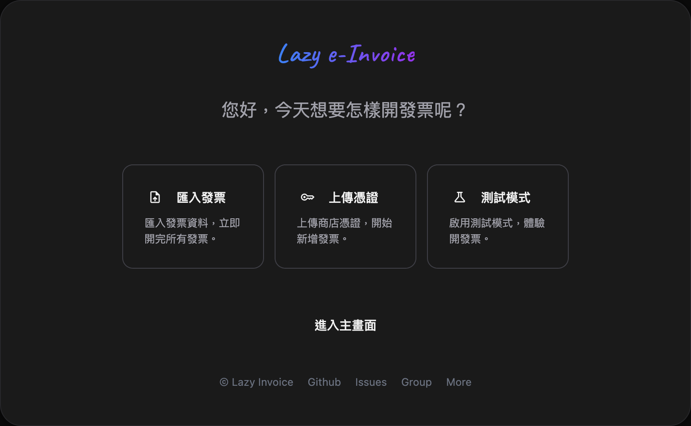

# Lazy Invoice

> 輕鬆自在開發票




**Lazy Invoice 的特色**：
- **平台支援**：支援 ECPay、ezPay、O'Pay、SmilePay、AMEGO 五家加值中心
- **發票開立**：使用 AI 工具協助處理，或在 UI 上手動新增
- **開立模式**：支援正式及測試兩種模式
- **彈性部署**：線上版純 JS，自架版需 PHP 環境

## 快速開始

### 線上使用
訪問 [https://invoice.lazypro.app](https://invoice.lazypro.app)

**隱私說明**：使用 Cloudflare Workers 轉發 API 請求，不記錄、不儲存任何發票資料。所有資料僅在瀏覽器與各平台 API 之間傳輸。

### 離線版本

若對線上版處理發票資料有隱私疑慮，可下載專案在本機 PHP 環境執行，資料完全私人化不外傳。

### 使用方式

1. **上傳發票資料**：點擊上傳按鈕，選擇包含憑證的 JSON 檔案
2. **自動切換平台**：系統自動偵測並切換到對應平台
3. **預覽與編輯**：檢視發票列表，可新增、修改、刪除
4. **批次開立**：點擊 Start 開始批次處理
5. **查看結果**：即時顯示成功/失敗狀態與統計

### 準備 JSON 資料

Lazy Invoice 接受標準化的 JSON 格式。**推薦使用 AI 工具（如 Claude 或 ChatGPT）** 將訂單資料轉換為所需格式。

📖 **完整轉換指南**：[AI-PROMPT-GUIDE.md](AI-PROMPT-GUIDE.md)

指南包含：
- 各平台 JSON 範本與欄位說明
- 載具類型與稅率對照表
- AI 轉換提示詞範例
- 特殊稅率發票處理方式

**參考範本**：`invoice-templates/` 目錄提供各平台完整 JSON 範本（包含所有稅率類型範例）
```
invoice-templates/
├── ecpay.json
├── ezpay.json
├── opay.json
├── smilepay.json
└── amego.json
```

## 支援平台

| 平台 | 開立 | 作廢 | 狀態 |
|-----|-----|-----|-----|
| ezPay（藍新金流） | ✓ | ✓ | 已測試 |
| ECPay（綠界科技） | ✓ | ✓ | 已測試 |
| O'Pay（歐付寶） | ✓ | ✓ | 已測試 |
| SmilePay（訊航） | ✓ | ✓ | 已測試 |
| Amego（雲端行動） | ✓ | ✓ | 已測試 |

## 開發指南

### 新增平台模組

參考 `js/modules/ezpay/` 目錄結構，複製並修改為新平台：

- `index.js` - 模組入口，實作 createInvoice 和 voidInvoice 方法
- `crypto.js` - 平台專屬加密邏輯
- `carrier.js` - 載具格式轉換規則
- `functions/create.js` - 開立發票實作
- `functions/void.js` - 作廢發票實作

### AI 開發指引

**給 AI 助手**：協助用戶開發新平台模組時，請注意以下資訊：

**專案架構**：
- ES6 模組系統，無框架依賴
- 事件驅動架構，使用 EventBus 進行模組間通訊
- 模組必須實作統一介面：`createInvoice()` 和 `voidInvoice()`

**參考實作**：
- 分析 `js/modules/ezpay/` 或 `js/modules/ecpay/` 的完整程式碼
- 研究 crypto.js 中平台專屬的加密模式
- 檢視 carrier.js 中載具類型的對應與轉換規則

**新模組必要檔案**：
1. `index.js` - 模組入口，實作標準介面
2. `crypto.js` - 平台專屬加密邏輯（MD5/SHA256/AES）
3. `carrier.js` - 載具類型對應與格式轉換
4. `functions/create.js` - 開立發票功能實作
5. `functions/void.js` - 作廢發票功能實作

**用戶會提供**：平台 API 文件、加密方式、API 端點網址

## 測試環境限制

各平台測試環境存在已知限制：

### ECPay（綠界科技）
- **混合稅率限制**：測試環境 08 字軌配額有限，混合稅率發票可能因字軌用完而失敗（錯誤碼：12001072）
- **建議**：正式環境無此限制，或聯繫 ECPay 申請測試環境字軌配額

### SmilePay（訊航科技）
- **混合稅率限制**：TaxType=9 僅限訊息 C0401 使用，一般 API 不支援（錯誤碼：-100611）
- **特種稅率限制**：測試環境無特種稅率字軌（錯誤碼：-10071）
- **建議使用測試統編**：`80129529`

### O'Pay（歐付寶）
- **統編白名單限制**：僅接受特定測試統編：`12345678`、`53538851`
- **字軌配額限制**：測試字軌配額有限
- 其他統編自動轉換為 `12345678`

### 通用限制
- 發票字軌配額限制
- 特定統編白名單限制
- 特殊稅率支援限制
- 晚上 12 點後部分加值中心無法作廢發票

**重要**：測試失敗通常是測試環境限制，非程式錯誤。正式環境無此限制。程式碼經過完整驗證，在測試環境可用的情況下成功率可達 90% 以上。

## 授權

**個人使用授權** - 允許個人/公司內部使用，禁止整合至對外服務

### 允許
- 個人或公司內部自行使用
- 修改以符合內部需求
- 學習研究用途

### 禁止
- 整合到對外提供的服務（免費或付費）
- 作為 SaaS 平台的一部分
- 再分發為商業產品

詳細條款請見 [LICENSE](LICENSE)

---

© 2025 Nel Tseng