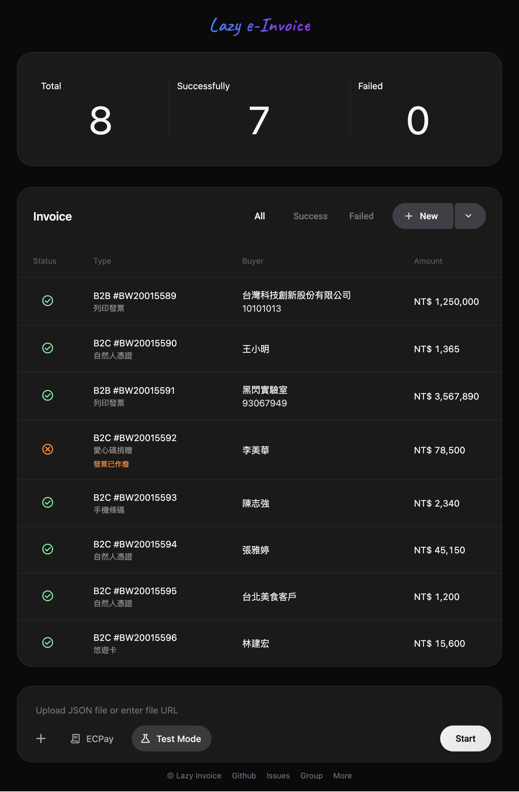

> 輕鬆自在開發票

Lazy Invoice 是統一介面的電子發票開立工具，支援台灣五大加值中心（ECPay、ezPay、O'Pay、SmilePay、Amego），透過 AI 工具協助將訂單資料轉換為標準 JSON 格式，批次開立發票，大幅降低手動操作成本。

## 解決什麼問題？

傳統的發票開立需要分別登入各個加值中心的後台，逐筆輸入發票資料，不僅耗時且容易出錯。若要同時處理多筆訂單或多個平台，重複的登入、切換、複製貼上更是讓人疲憊。

```
傳統流程：
訂單資料 → 登入加值中心 → 逐筆手動輸入 → 開立發票
           (多個平台)     (重複操作)      (容易出錯)
```

Lazy Invoice 將這個流程簡化：使用 AI 工具（如 Claude、ChatGPT）將訂單資料轉換為標準 JSON 格式，上傳後系統自動偵測平台並切換，批次開立發票，結果即時顯示，所有操作都在統一介面完成。

```
Lazy Invoice 流程：
訂單資料 → AI 轉換 → 上傳 JSON → 批次開立
          (自動格式化)  (自動偵測)  (統一介面)
```

## 功能特色

- **平台支援**：支援 ECPay、ezPay、O'Pay、SmilePay、Amego 五家加值中心
- **AI 輔助**：使用 AI 工具將訂單資料轉換為標準格式
- **批次處理**：一次上傳多筆發票，自動批次開立
- **即時回饋**：開立狀態即時顯示，成功/失敗一目了然
- **雙模式**：正式模式（實際開立）/ 測試模式（測試環境）
- **零信任架構**：API 金鑰和發票資料都在使用者自己掌控中

## 介面預覽



## 快速開始

請參閱 [快速開始](content/01-quick-start.md) 章節。
